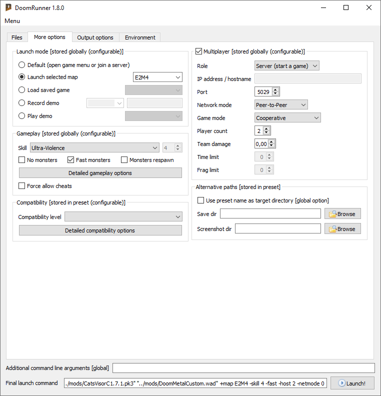

# Doom Runner

Doom Runner is yet another launcher of ZDoom and derivatives with graphical user interface. It is written in C++ and Qt, and it is designed around the idea of presets for various multi-file modifications (Brutal Doom with mutators, Project Brutality with UDV, Complex Doom Clusterfuck, ...) to allow one-click switching between them and minimize any repetitive work.

First you perform an initial setup, setting up the paths and adding all your Doom engines and IWADs.\


Then you create named presets for all your favourite modifications and assign them an engine, an IWAD and mod files.\


If you wish to play multiplayer or jump into a map directly, you can do so in the second tab.\


You can even configure gameplay flags and compatibility flags, with tooltips from official ZDoom wiki.\


If you extract a .wad file together with an equally named .txt file (for example AV.wad and AV.txt), you can display its content by doubleclicking the wad in the map pack list.\


The map list and IWAD list are automatically updated from selected directory, so everytime you download a new WAD, you don't need to manually add it to the launcher. The mod list supports drag&drop from directory window and internal drag&drop for reordering the files.


## Download

Pre-compiled executables for different operating systems can be found on [release page](https://github.com/Youda008/DoomRunner/releases)

32-bit Linux build is currently not supported, because i don't have enough space on disk to install yet another operating system. But you can build it yourself, it shouldn't be hard.

For Windows I only provide statically linked executable, because dynamic one does not make much sense. On Windows installing the Qt DLLs required to run this program is pain in the ass, and it's much easier to bundle everything together in a single file. If you really want the dynamic version, because you use lot's of Qt applications and saving those 20MB sounds worth it, please create an issue.


## How to install and run

### Windows

Because of the static linking, everything is present in the executable. You just need to extract the executable into some directory and it is good to run.

### Linux

On Linux, i wasn't able to make a static build yet. Therefore you need to install the following shared libraries to make the app run.

* libqt5core
* libqt5gui
* libqt5widgets

On Ubuntu use
```
sudo apt install libname
```
or some graphical package manager like Muon.

#### Arch Linux

Thanks to PopeRigby, Arch Linux users can now install DoomRunner via package manager from repository https://aur.archlinux.org/packages/doomrunner


## How to build

In general you need 2 things
1. A C++ compiler
2. Qt libraries built with the SAME compiler + Qt development tools (qmake, moc, uic, ...)

I'm going to show you exact steps for building in Windows using Msys2 and in Ubuntu and derivatives. If you use a different build system on Windows or different Linux distro, you will have to experiment.


### Windows

#### Using Msys2

For instructions how to install Msys2 check www.msys2.org

Use Msys2-MinGW-64 terminal to enter the following commands.

##### 1. Install package management simplification utils
```
pacman -S pactoys
```

##### 2. Install g++ compiler
```
pacboy -S gcc:x
```

##### 3. Install Qt

for dynamically linked version
```
pacboy -S qt5:x
```
for statically linked version
```
pacboy -S qt5-static:x
```

##### 4. Build the project
```
cd <DoomRunner directory>
```
for dynamically linked version
```
mkdir build-dynamic
cd build-dynamic
qmake ../DoomRunner.pro -spec win32-g++ "CONFIG+=release"
mingw32-make
```
for statically linked version
```
mkdir build-static
cd build-static
C:/msys64/mingw64/qt5-static/bin/qmake ../DoomRunner.pro -spec win32-g++ "CONFIG+=release"
mingw32-make
```
	

#### Using plain old MinGW

Not supported yet.
You have to download the Qt sources and compile Qt by yourself. I cannot give you an advice here, because i tried it several times, but never got passed certain compilation errors. Alternativelly you can try to google and download pre-build Qt, but it has to be compiled by the SAME VERSION of compiler that you have installed, otherwise it might not link with your application.


#### Using Visual Studio

Not supported yet.
You have to download the Qt sources and compile Qt by yourself. I cannot give you an advice here, because i don't use Visual Studio at all. Alternativelly you can try to google and download pre-build Qt, but it has to be compiled by the SAME VERSION of compiler that you have installed, otherwise it might not link with your application.


### Linux (Ubuntu and derivatives)

##### 1. Install g++ compiler
```
sudo apt install g++
```
	
##### 2. Install Qt
```
sudo apt install qt5-default
```
	
##### 3. Build the project
```
cd <DoomRunner directory>
mkdir build-dynamic
cd build-dynamic
qmake ../DoomRunner.pro -spec linux-g++ "CONFIG+=release"
make
```


## Reporting issues and requesting features

If you encouter a bug or just want the launcher to work differently, you can either create an issue here on github or reach me on email youda008@gmail.com or on Discord as Youda#0008.
