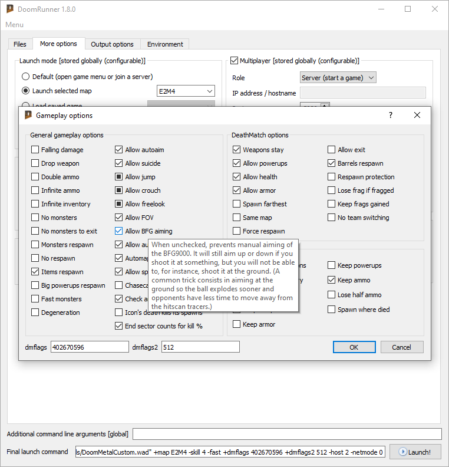
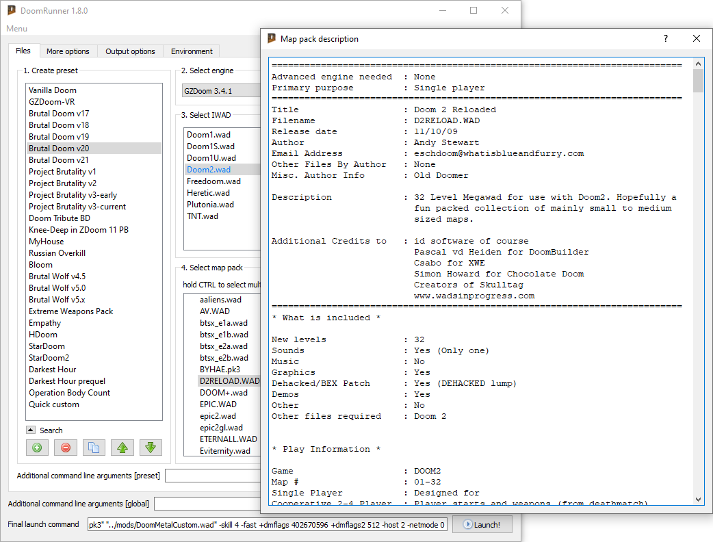

# Doom Runner

Doom Runner is yet another launcher of common Doom source ports (like GZDoom, Zandronum, PrBoom, ...) with graphical user interface. It is written in C++ and Qt, and it is designed around the idea of presets for various multi-file modifications (Brutal Doom with mutators, Project Brutality with UDV, Complex Doom Clusterfuck, ...) to allow one-click switching between them and minimize any repetitive work.

First you perform an initial setup, setting up the paths and adding all your Doom engines and IWADs.\


Then you create named presets for all your favourite modifications and assign them an engine, an IWAD and mod files.\


If you wish to play multiplayer or jump into a map directly, you can do so in the second tab.\


You can even configure gameplay flags and compatibility flags, with tooltips from official ZDoom wiki.\


If you extract a .wad file together with an equally named .txt file (for example AV.wad and AV.txt), you can display its content by doubleclicking the wad in the map pack list.\


And now the launcher even has a dark theme!


### Features

* Unlimited number of named presets switchable with a single-click
* Lists of IWADs and Map packs are automatically synchronized with the content of a selected directory
* Drag&Drop for easy adding of files or re-ordering them
* Ability to quickly tick or untick any files to load without the need to remove and re-add them
* Ability to start a multiplayer game on LAN
* Ability to directly start selected map, load selected save or record/replay a demo
* DM flags and Compatibility flags calculator with tooltips from official ZDoom wiki
* Ability to automatically put save files, demo files or screenshots in a directory named after the selected preset
* Ability to filter the saved presets using a search phrase or regular expression
* Choice between light and dark theme that can follow system preferences

### Advantages over other launchers

* Compatible with most commonly used source ports:  
ZDoom, GZDoom, Skultag, Zandronum, PrBoom, Eternity, Chocolate Doom, Crispy Doom, ...  
... and support for more can be easily added if requested
* Runs on Windows and Linux (installable via Flatpak or AUR)
* Does not require any special runtime like .NET or JRE

### Disadvantages over other launchers

* Does not have any browser or downloader of known mods.  
You must find the mods, download them, and add them to the launcher by yourself.
* Cannot show public multiplayer servers.  
You can join a server only by entering its hostname of IP address.

### Project's state

The development is near the end. I don't plan to add any big new features, only bug-fixes of reported issues and small usability improvements.


## Download

Pre-compiled executables for different operating systems can be found on [release page](https://github.com/Youda008/DoomRunner/releases)

32-bit Linux build is currently not supported, because i don't have enough space on disk to install yet another operating system. But you can build it yourself, it shouldn't be hard.

For Windows I only provide statically linked executable, because installing the Qt DLLs required to run this program is too much work and it's easier to have everything bundled together.


## How to install and run


### Windows

The `DoomRunner.exe` bundles everything inside itself. Just extract it into some directory and it is good to go. Putting it to `Program Files` is also supported.

#### Scoop

For users of [Scoop](https://scoop.sh/), thanks to [sitiom](https://github.com/sitiom) it is now available in the games bucket:
```
scoop bucket add games
scoop install doomrunner
```


### Linux

On Linux you have few options.

#### Install manually

Extract the executable in where you usually put them, commonly `/usr/bin` or `/opt/DoomRunner`.

Then you need to install the following shared libraries to make the app run.

* `libqt5core`
* `libqt5gui`
* `libqt5widgets`
* `libqt5network`

Please note that in different distributions the libraries might have slightly different names, for example in Ubuntu 22 LTS they are called `libqt5core5a`, `libqt5gui5`, ...

Use your distribution package manager to find and install those

* Ubuntu: `sudo apt install libname`
* Arch: `pacman -S libname`
* ...
* or use some graphical package manager like for example Muon

The executable was built in Kubuntu 22.04 LTS so there is a chance that it will not find the libraries in other distributions. In that case you will need to build it yourself.

#### Install via Flatpak

Thanks to [Massi aka Ergosum](https://github.com/mbugni), Doom Runner can now be installed via [Flatpak](https://flatpak.org/) from this package TODO: link, using the following commands:
```
TODO
```

#### Install from AUR

Thanks to [PopeRigby](https://github.com/poperigby), Arch Linux users can now leverage [AUR](https://wiki.archlinux.org/title/Arch_User_Repository) to install Doom Runner via package manager from this [package](https://aur.archlinux.org/packages/doomrunner) using the following commmands:
```
TODO
```

#### Install on NixOS

Thanks to [Keenan Weaver](https://github.com/keenanweaver), NixOS users can now install Doom Runner [package](https://search.nixos.org/packages?channel=unstable&show=doomrunner&from=0&size=50&sort=relevance&type=packages&query=doomrunner) using the following instructions.

##### via the package manager
```
nix-env -iA nixpkgs.doomrunner
```

##### via the configuration file

1. Add one of the following to your configuration.nix
```
  environment.systemPackages = with pkgs; [
    doomrunner
  ];
```
or
```
  users.users.yourUserName.packages = with pkgs; [
    doomrunner
  ];
```

2. Rebuild the system with `nixos-rebuild`


## How to build

In general you need 2 things
1. A C++ compiler
2. Qt libraries built with the SAME compiler + Qt development tools (qmake, moc, uic, ...)

I'm going to show you exact steps for building in Windows using Msys2 and in Ubuntu and derivatives. If you use a different build system on Windows or different Linux distro, you will have to experiment.


### Windows

#### Using Msys2

For instructions how to install Msys2 check [www.msys2.org](https://www.msys2.org)

Use Msys2-MinGW-64 terminal to enter the following commands.

##### 1. Install package management simplification utils
```
pacman -S pactoys
```

##### 2. Install g++ compiler
```
pacboy -S gcc:x
```

##### 3. Install Qt

for dynamically linked version
```
pacboy -S qt5:x
```
for statically linked version
```
pacboy -S qt5-static:x
```

##### 4. Build the project
```
cd <DoomRunner directory>
```
for dynamically linked version
```
mkdir build-dynamic
cd build-dynamic
qmake ../DoomRunner.pro -spec win32-g++ "CONFIG+=release"
mingw32-make
```
for statically linked version
```
mkdir build-static
cd build-static
C:/msys64/mingw64/qt5-static/bin/qmake ../DoomRunner.pro -spec win32-g++ "CONFIG+=release"
mingw32-make
```

#### Using Visual Studio

Not supported yet.
You have to download the Qt sources and compile Qt by yourself. I cannot give you an advice here, because i don't use Visual Studio at all. Alternativelly you can try to google and download pre-build Qt, but it has to be compiled by the SAME VERSION of compiler that you have installed, otherwise it might not link with your application.


### Linux (Ubuntu and derivatives)

##### 1. Install g++ compiler
```
sudo apt install g++
```

##### 2. Install Qt
```
sudo apt install qtbase5-dev qt5-qmake
```

##### 3. Build the project
```
cd <DoomRunner directory>
mkdir build-dynamic
cd build-dynamic
qmake ../DoomRunner.pro -spec linux-g++ "CONFIG+=release"
make
```


## Reporting issues and requesting features

If you encouter a bug or just want the launcher to work differently, you can either create an issue here on github or reach me on email youda008@gmail.com or on Discord as Youda008.
